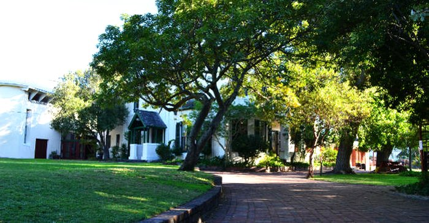
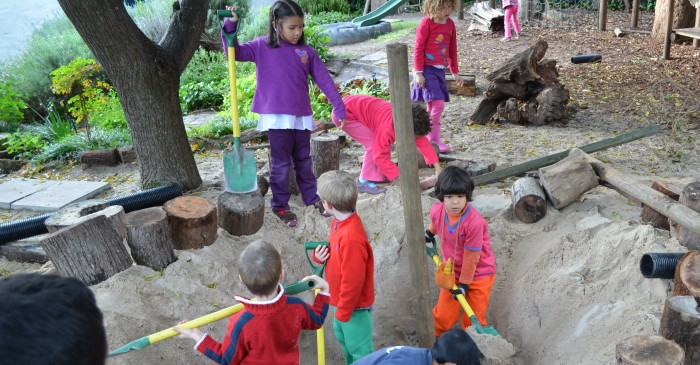

# Education For The World Of Tomorrow

** Michael Oak Waldorf School seeks to awaken the whole child towards creative responsibility, developing confident, balanced individuals empowered to work with the challenges of today and tomorrow.**

Our campus in the heart of Kenilworth, Cape Town was established in 1962 With around 430 pupils at Nursery, Primary and High school, it is one of 16 Waldorf Schools in South Africa and more than 1000 worldwide.

Beginning in the [Nursery](/curriculum/nursery), in a welcoming and beautiful environment, the children’s days are filled with artistic and practical work, imaginative play, fairy tales, music, circle games and healthy outdoor play. 

Although there is no formal intellectual work at this stage, the children acquire numerous skills that provide a firm foundation for on-going development.

The [Primary School](curriculum/primary) and [High School](curriculum/highschool) draw on an internationally successful [Waldorf](/curriculum/waldorfed) curriculum designed to meet the child’s emotional, spiritual and intellectual needs at each age.

 Based on a profound understanding of human nature, the curriculum covers all the required subjects and is adapted to our African context.

 The “main lesson” system allows each subject to be explored in depth over several weeks, including practical activities such as Grade 3 growing their own vegetable garden and Grade 10 doing survey work as an introduction to trigonometry. 

 The [High School](#High-School) provides challenges and exposure to business, civic and social responsibilities, many imaginative and creative tasks and unique opportunities for personal growth and the pursuit of academic excellence, acquiring all the skills required for tertiary education. 

 *We honour the different spiritual backgrounds of our students, while also nurturing interconnectedness and community.*
 
 
 Art, drama, music, craft and movement are all valued aspects of the curriculum. Our sport includes: basketball, TAG, table tennis, volleyball, dance and tennis.

